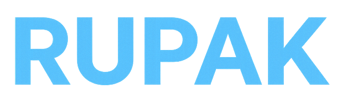

<h1 align="center"> </h1>

---

## 🌐 Socials

---

# 💻 Tech Stack

---

# 📊 GitHub Stats

---

# 🏆 GitHub Trophies

---

## 🌱 Currently Learning

- Machine Learning

---

## 📫 Contact Me

📧 **e.rupak.25@gmail.com**

